# StreamingETL

StreamingETL is an end-to-end streaming data pipeline that ingests real
Wikimedia recent-change events, stores raw data in a Bronze lake layer, cleans
and validates it into Silver, models it into Gold analytics tables, and serves
those tables through a dashboard.

The project is built to show how a streaming data platform can be developed
locally with Docker while still using cloud storage for the lakehouse layers.

## Why This Project Exists

Streaming pipelines need more than a producer and consumer. They also need raw
data preservation, repeatable transformations, data quality checks, bad-record
handling, orchestration, and a serving layer for analytics.

This project connects those pieces into one workflow:

- Ingest live events continuously from Wikimedia.
- Buffer events in Kafka so consumers can process data independently.
- Persist raw Kafka messages to Azure Storage as the Bronze layer.
- Clean, validate, and standardize records into the Silver layer.
- Build Gold star-schema tables and dashboard aggregates.
- Orchestrate batch refreshes with Airflow.
- Visualize curated Gold data through a Streamlit dashboard.

## Architecture

```mermaid
flowchart LR
    A[Wikimedia Recent Changes SSE] --> B[Kafka Producer]
    B --> C[Kafka Topic]
    C --> D[Spark Structured Streaming]
    D --> E[Azure Bronze Layer]
    E --> F[Airflow DAG]
    F --> G[Spark Bronze to Silver]
    G --> H[Azure Silver Layer]
    H --> I[Data Quality Checks]
    I --> J[Quarantine Bad Records]
    I --> K[Spark Silver to Gold]
    K --> L[Azure Gold Star Schema]
    L --> M[Dashboard Aggregates]
    M --> N[Redis Cache]
    N --> O[Streamlit Dashboard]
```



## Data Flow

1. **Source to Kafka**

   `src/data_extraction/kafka_extraction.py` reads Wikimedia recent-change
   events and produces them into a Kafka topic.

2. **Kafka to Bronze**

   `src/data_transformation/kafka_to_bronze.py` consumes Kafka messages with
   Spark Structured Streaming and writes the raw records to the Azure Bronze
   container.

3. **Bronze to Silver**

   `src/data_transformation/Spark_transformations.py` reads Bronze data, parses
   Wikimedia JSON, applies schema checks, cleans text fields, handles nulls,
   marks late-arriving records, and writes valid records to Silver.

4. **Bad Records to Quarantine**

   Records that fail quality rules are written to a quarantine container so they
   can be reviewed or replayed without losing the original event.

5. **Silver to Gold**

   `src/data_transformation/silver_to_gold.py` reads Silver data and creates
   dimensional tables, a recent-changes fact table, and pre-aggregated dashboard
   tables.

6. **Dashboard**

   `src/data_visualization/gold_dashboard.py` reads Gold tables, caches results
   with Redis, and displays operational and analytical metrics.

## Lakehouse Layers

| Layer | Purpose | Example Data |
| --- | --- | --- |
| Bronze | Raw Kafka messages and metadata | Kafka key, value, topic, partition, offset, timestamp |
| Silver | Cleaned and validated event records | Event id, wiki, page, user, event time, bot flag |
| Quarantine | Rejected or malformed records | Raw message, quality error, processing date |
| Gold | Analytics-ready models | Dimensions, fact table, KPI aggregates |

## Tech Stack

| Area | Tools |
| --- | --- |
| Source | Wikimedia Recent Changes SSE |
| Messaging | Apache Kafka, Kafka UI |
| Processing | PySpark, Spark Structured Streaming |
| Storage | Azure Data Lake Storage Gen2 compatible `abfss://` paths |
| Orchestration | Apache Airflow |
| Data Quality | Schema validation, null checks, quarantine, duplicate checks |
| Serving | Gold star schema and aggregate tables |
| Visualization | Streamlit, Redis |
| Runtime | Docker, Docker Compose |
| CI/CD | GitHub Actions, uv |

## Project Structure

```text
src/data_extraction        Wikimedia source reader and Kafka producer
src/data_transformation    Spark jobs, lakehouse utilities, quality checks
src/data_visualization     Streamlit dashboard, dashboard validation, Redis cache
src/airflow/dags           Airflow DAG orchestration
docs                       Additional notes and operating commands
```

## Environment Setup

Copy the example environment file:

```bash
cp .env.example .env
```

Install Python dependencies for local runs:

```bash
uv sync
```

Fill these Azure values in `.env` before writing lakehouse data:

```text
AZURE_STORAGE_ACCOUNT_NAME
AZURE_STORAGE_ACCOUNT_KEY
AZURE_BRONZE_CONTAINER_NAME
AZURE_SILVER_CONTAINER_NAME
AZURE_GOLD_CONTAINER_NAME
AZURE_QUARANTINE_CONTAINER_NAME
```

Create the Azure Storage containers before running the pipeline:

```text
bronze
silver
gold
quarantine
```

The exact container names can be changed in `.env`.

## Run With Docker Compose

Start Kafka and Kafka UI:

```bash
docker compose up -d
```

Run the full local stack:

```bash
docker compose --profile streaming --profile airflow --profile dashboard up -d --build
```

Open the services:

```text
Kafka UI:   http://localhost:9091
Airflow:    http://localhost:8080
Dashboard:  http://localhost:8501
```

Check running containers:

```bash
docker compose ps
```

Follow logs:

```bash
docker compose logs -f wikimedia-producer-stream kafka-to-bronze-stream airflow dashboard
```

## Run Individual Steps

Produce five events to Kafka:

```bash
uv run python src/data_extraction/kafka_extraction.py --limit 5
```

Write Kafka messages to Bronze:

```bash
uv run python src/data_transformation/kafka_to_bronze.py --limit 5
```

Transform Bronze to Silver:

```bash
uv run python src/data_transformation/Spark_transformations.py --write-silver
```

Build Gold tables:

```bash
uv run python src/data_transformation/silver_to_gold.py
```

Validate dashboard data:

```bash
uv run python src/data_visualization/dashboard_data_check.py
```

Run the dashboard locally:

```bash
uv run streamlit run src/data_visualization/gold_dashboard.py
```

## Airflow Orchestration

The Airflow DAG is located at:

```text
src/airflow/dags/streamingetl_pipeline_dag.py
```

The DAG handles:

- Bronze to Silver transformation.
- Silver to Gold modeling.
- Lakehouse quality validation.
- Dashboard data validation.
- Dashboard service health check.

The producer and Kafka-to-Bronze streaming jobs run as long-running Docker
services. Airflow periodically refreshes the curated Silver and Gold layers.

## Data Quality And Reprocessing

The transformation layer includes:

- Schema validation before cleaning.
- Null handling for required fields.
- Duplicate handling using event metadata.
- Bad-record quarantine.
- Late-arriving data flags.
- Optional backfill date filters.
- Partitioned writes for faster reads and reruns.

Silver and Gold writes can be configured through `.env`, including write mode,
partition columns, and output paths.

## CI/CD

GitHub Actions workflow:

```text
.github/workflows/ci-cd.yml
```

The workflow runs on pushes to `main` and validates the project with dependency
installation, syntax checks, and Docker build checks.

## Useful Commands

Restart Airflow after DAG changes:

```bash
docker compose restart airflow
```

Rebuild the dashboard after code changes:

```bash
docker compose --profile dashboard up -d --build dashboard
```

Stop the stack:

```bash
docker compose down
```

Stop the stack and remove named volumes:

```bash
docker compose down -v
```
