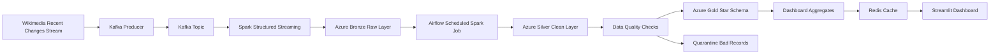

# StreamingETL

StreamingETL is an end-to-end streaming data engineering project built around
real Wikimedia recent-change events. It demonstrates a production-style pipeline
with Kafka ingestion, Spark transformations, Azure Data Lake layers, Airflow
orchestration, data quality checks, Redis caching, and a Streamlit analytics
dashboard.

This project is designed as a portfolio-ready data engineering system, not just
a script collection.

## What This Demonstrates

- Real-time ingestion from a public streaming API into Kafka.
- Spark Structured Streaming from Kafka into a Bronze lake layer.
- Bronze, Silver, Gold lakehouse architecture on Azure Storage.
- Schema validation, null handling, bad-record quarantine, backfills, and late-arriving data support.
- Gold star schema plus dashboard-ready aggregate tables.
- Airflow DAG orchestration with scheduled Silver and Gold refreshes.
- Streamlit dashboard backed by curated Gold tables and Redis cache.
- Dockerized local runtime with Kafka UI, Airflow UI, Redis, and dashboard.
- CI/CD validation with GitHub Actions on pushes to `main`.

## Architecture



## Tech Stack

| Layer | Tools |
| --- | --- |
| Source | Wikimedia Recent Changes SSE |
| Messaging | Apache Kafka, Kafka UI |
| Processing | PySpark, Spark Structured Streaming |
| Storage | Azure Data Lake Storage Gen2 style `abfss://` paths |
| Orchestration | Apache Airflow |
| Quality | Schema validation, quarantine, duplicate/null checks |
| Serving | Gold star schema, dashboard aggregate tables |
| Visualization | Streamlit, Redis cache |
| Runtime | Docker, Docker Compose |
| CI/CD | GitHub Actions, uv |

## Project Structure

```text
src/data_extraction        Source reader and Kafka producer
src/data_transformation    Spark readers, Bronze/Silver/Gold jobs, quality checks
src/data_visualization     Streamlit dashboard and Redis cache helper
src/airflow/dags           Airflow DAG for scheduled orchestration
docs                       Architecture notes, demo guide, operating runbook
```

## Local Setup

```bash
cp .env.example .env
uv sync
```

Fill these Azure values in `.env` before writing lakehouse data:

```text
AZURE_STORAGE_ACCOUNT_NAME
AZURE_STORAGE_ACCOUNT_KEY
AZURE_BRONZE_CONTAINER_NAME
AZURE_SILVER_CONTAINER_NAME
AZURE_GOLD_CONTAINER_NAME
AZURE_QUARANTINE_CONTAINER_NAME
```

Create the containers in your Azure Storage account first.

## Run The Project

Start Kafka and Kafka UI:

```bash
docker compose up -d
```

Run the full always-on local stack:

```bash
docker compose --profile streaming --profile airflow --profile dashboard up -d --build
```

Open the UIs:

```text
Kafka UI:   http://localhost:9091
Airflow:    http://localhost:8080
Dashboard:  http://localhost:8501
```

Check service health:

```bash
docker compose ps
docker compose logs -f wikimedia-producer-stream kafka-to-bronze-stream airflow dashboard
```

## One-Time Demo Commands

Produce 5 Wikimedia events to Kafka:

```bash
uv run python src/data_extraction/kafka_extraction.py --limit 5
```

Land Kafka messages into Bronze:

```bash
uv run python src/data_transformation/kafka_to_bronze.py --limit 5
```

Clean Bronze into Silver:

```bash
uv run python src/data_transformation/Spark_transformations.py --write-silver
```

Build Gold models and dashboard aggregates:

```bash
uv run python src/data_transformation/silver_to_gold.py
```

Open the dashboard:

```bash
uv run streamlit run src/data_visualization/gold_dashboard.py
```

## Recruiter-Friendly Walkthrough

See [docs/demo-guide.md](docs/demo-guide.md) for a short demo script and what
to show in a portfolio interview.

See [docs/project-brief.md](docs/project-brief.md) for a concise project summary
you can reuse in resumes, LinkedIn, or GitHub pinned project descriptions.

See [docs/operations-runbook.md](docs/operations-runbook.md) for the operating
commands that make the project feel production-minded.
