# StreamingETL — Production Streaming Lakehouse Platform

An end-to-end streaming data platform that ingests live Wikimedia recent-change events, stores raw records in a medallion lakehouse (Bronze / Silver / Gold), serves analytics through a Streamlit dashboard, and runs on Kubernetes with Terraform-provisioned Azure infrastructure.

---

## Architecture

```
┌─────────────────────────────────────────────────────────────────────────────┐
│                         StreamingETL Platform                               │
│                                                                             │
│  ┌──────────────┐    ┌──────────────────────┐    ┌────────────────────┐    │
│  │  Wikimedia   │───▶│   Apache Kafka        │───▶│  Spark Structured  │    │
│  │  SSE Source  │    │  3-broker KRaft       │    │  Streaming         │    │
│  └──────────────┘    │  (StatefulSet, k8s)   │    │  (kafka → Bronze)  │    │
│                      └──────────────────────┘    └────────┬───────────┘    │
│                                                            │                │
│                                          ┌─────────────────▼─────────────┐  │
│                                          │   Azure Data Lake Storage Gen2 │  │
│                                          │   bronze/   silver/            │  │
│                                          │   gold/     quarantine/        │  │
│                                          └──────────────┬────────────────┘  │
│                                                         │                   │
│                         ┌───────────────────────────────┤                   │
│                         │                               │                   │
│                ┌────────▼──────────┐          ┌────────▼──────────┐        │
│                │  Spark Batch Job   │          │  Spark Batch Job   │        │
│                │  Bronze → Silver   │          │  Silver → Gold     │        │
│                │  (validate, dedup) │          │  (star schema)     │        │
│                └────────┬──────────┘          └────────┬──────────┘        │
│                         │                               │                   │
│                ┌────────▼───────────────────────────────▼──────────┐        │
│                │              Apache Airflow (k8s)                   │        │
│                │  DAG: bronze→silver → silver→gold → quality check   │        │
│                └──────────────────────────┬───────────────────────┘        │
│                                           │                                  │
│                              ┌────────────▼────────────┐                    │
│                              │  Streamlit Dashboard     │                    │
│                              │  + Redis cache (k8s)     │                    │
│                              └─────────────────────────┘                    │
│                                                                              │
│  ┌──────────────────────────────────────────────────────────────────────┐   │
│  │  Infrastructure Layer (Terraform → Azure)                             │   │
│  │  Resource Group │ ADLS Gen2 (4 containers) │ AKS (autoscale 2-6)    │   │
│  │  Azure Container Registry │ Managed identities                        │   │
│  └──────────────────────────────────────────────────────────────────────┘   │
└──────────────────────────────────────────────────────────────────────────────┘
```

---

## Repository Structure

```
StreamingETL/
├── src/
│   ├── data_extraction/
│   │   ├── kafka_extraction.py        # Wikimedia SSE → Kafka producer
│   │   └── wikimedia_recent_changes_extract.py
│   ├── data_transformation/
│   │   ├── kafka_to_bronze.py         # Spark Structured Streaming → ADLS Bronze
│   │   ├── Spark_transformations.py   # Bronze → Silver (validate, dedup, quarantine)
│   │   └── silver_to_gold.py          # Silver → Gold (star schema, aggregates)
│   ├── data_visualization/
│   │   ├── gold_dashboard.py          # Streamlit dashboard
│   │   └── dashboard_data_check.py    # Gold table validation
│   └── airflow/dags/
│       └── streamingetl_pipeline_dag.py
├── k8s/
│   ├── namespace.yaml                 # streamingetl namespace
│   ├── configmap.yaml                 # Non-secret pipeline config
│   ├── kafka/
│   │   ├── kafka-deployment.yaml      # 3-broker KRaft StatefulSet + PVCs
│   │   ├── kafka-service.yaml         # Headless + ClusterIP services
│   │   └── kafka-hpa.yaml             # HPA: scale 3-5 on CPU >70%
│   ├── airflow/
│   │   ├── airflow-deployment.yaml    # Airflow + init container + PVC
│   │   └── airflow-service.yaml
│   ├── dashboard/
│   │   └── dashboard-deployment.yaml  # Streamlit + LoadBalancer + HPA (2-6 replicas)
│   └── redis/
│       └── redis-deployment.yaml      # Redis cache + ClusterIP service
├── terraform/
│   ├── main.tf                        # Provider, resource group
│   ├── variables.tf                   # All configurable inputs
│   ├── outputs.tf                     # Storage key, ACR server, kubeconfig
│   ├── storage.tf                     # ADLS Gen2 + 4 lake containers
│   └── aks.tf                         # AKS cluster + ACR + role assignment
├── tests/
│   └── test_pipeline.py               # 20+ unit and smoke tests
├── Dockerfile                         # App image (Python + Java + PySpark)
├── Dockerfile.airflow                 # Airflow image with DAGs baked in
├── docker-compose.yaml                # Local full-stack
├── .env.example                       # All environment variables documented
└── .github/workflows/ci-cd.yml        # 3-job CI/CD: test → build → deploy
```

---

## Tech Stack

| Layer | Tools |
|---|---|
| Source | Wikimedia Recent Changes SSE |
| Messaging | Apache Kafka 3.7 (KRaft, 3-broker StatefulSet) |
| Stream Processing | PySpark, Spark Structured Streaming |
| Storage | Azure Data Lake Storage Gen2 (abfss://) |
| Orchestration | Apache Airflow 3 (DAG: every 5 min) |
| Data Quality | Schema validation, null checks, quarantine, deduplication |
| Visualization | Streamlit, Redis |
| Infrastructure (IaC) | Terraform (azurerm ~3.90) |
| Container Orchestration | Kubernetes — AKS (autoscale 2-6 nodes) |
| Containerization | Docker, Docker Compose |
| CI/CD | GitHub Actions (test → build → AKS deploy) |

---

## Lakehouse Layers

| Layer | Purpose | Format |
|---|---|---|
| Bronze | Raw Kafka messages + metadata | Parquet, partitioned by date + topic |
| Silver | Validated, deduplicated, schema-enforced records | Parquet, partitioned by event_date |
| Quarantine | Rejected records with error reason, preserved for replay | Parquet |
| Gold | Star schema: fact table + dimensions + KPI aggregates | Parquet, overwrite |

---

## Kubernetes Scaling

| Component | Min Replicas | Max Replicas | Scale Trigger |
|---|---|---|---|
| Kafka (StatefulSet) | 3 | 5 | CPU > 70% |
| Airflow | 1 | 1 | Manual (SequentialExecutor) |
| Dashboard | 2 | 6 | CPU > 60% |
| Redis | 1 | 1 | Fixed (cache) |

Kafka min replicas are locked at 3 to maintain KRaft quorum. The HPA scaleDown stabilization window is 5 minutes to prevent broker churn during load spikes.

---

## Infrastructure Setup (Terraform)

### Prerequisites
- Terraform >= 1.5
- Azure CLI authenticated (`az login`)
- An active Azure subscription

```bash
cd terraform/

# Initialise providers
terraform init

# Preview changes
terraform plan \
  -var="subscription_id=<YOUR_SUBSCRIPTION_ID>" \
  -var="resource_group_name=streamingetl-rg" \
  -var="location=eastus"

# Provision: Resource Group, ADLS Gen2, AKS (3-node), ACR
terraform apply -auto-approve \
  -var="subscription_id=<YOUR_SUBSCRIPTION_ID>"

# Get kubeconfig for AKS
az aks get-credentials \
  --resource-group streamingetl-rg \
  --name streamingetl-aks
```

Outputs:
- `acr_login_server` — ACR URL for Docker push
- `storage_account_name` — fill into `.env`
- `storage_account_primary_key` (sensitive) — fill into `.env`
- `kube_config` (sensitive) — written to `~/.kube/config` by `az aks get-credentials`

---

## Kubernetes Deployment

```bash
# Apply all manifests in order
kubectl apply -f k8s/namespace.yaml
kubectl apply -f k8s/configmap.yaml
kubectl apply -f k8s/redis/
kubectl apply -f k8s/kafka/
kubectl apply -f k8s/airflow/
kubectl apply -f k8s/dashboard/

# Verify all pods are running
kubectl get pods -n streamingetl

# Expected output:
# kafka-0                  1/1   Running
# kafka-1                  1/1   Running
# kafka-2                  1/1   Running
# airflow-xxx              1/1   Running
# dashboard-xxx            1/1   Running
# dashboard-yyy            1/1   Running
# redis-xxx                1/1   Running

# Get the dashboard external IP
kubectl get svc dashboard -n streamingetl
# Access: http://<EXTERNAL-IP>:8501

# Get the Airflow URL
kubectl port-forward svc/airflow 8080:8080 -n streamingetl
# Access: http://localhost:8080
```

### Scaling Kafka manually
```bash
# Scale to 5 brokers
kubectl scale statefulset kafka --replicas=5 -n streamingetl

# Watch scale-up
kubectl rollout status statefulset/kafka -n streamingetl
```

---

## Local Run (Docker Compose)

```bash
# Copy and fill environment file
cp .env.example .env
# Required: AZURE_STORAGE_ACCOUNT_NAME, AZURE_STORAGE_ACCOUNT_KEY

# Start Kafka + Kafka UI
docker compose up -d

# Start full stack (streaming, Airflow, dashboard)
docker compose --profile streaming --profile airflow --profile dashboard up -d --build

# Services:
# Kafka UI:    http://localhost:9091
# Airflow:     http://localhost:8080
# Dashboard:   http://localhost:8501
```

---

## Run Pipeline Steps Manually

```bash
# Install dependencies
uv sync

# 1. Produce 10 Wikimedia events to Kafka
uv run python src/data_extraction/kafka_extraction.py --limit 10

# 2. Write Kafka messages to Bronze layer
uv run python src/data_transformation/kafka_to_bronze.py --limit 10

# 3. Transform Bronze → Silver (validate, deduplicate, quarantine bad records)
uv run python src/data_transformation/Spark_transformations.py --write-silver

# 4. Build Gold analytics tables (star schema)
uv run python src/data_transformation/silver_to_gold.py

# 5. Validate Gold data
uv run python src/data_visualization/dashboard_data_check.py

# 6. Launch Streamlit dashboard
uv run streamlit run src/data_visualization/gold_dashboard.py
```

---

## Tests

```bash
# Run all tests
uv run pytest tests/ -v

# Test output covers:
# TestKafkaProducer          — message key logic, env validation
# TestBronzeSchema           — required field presence
# TestSilverTransforms       — null rejection, deduplication, bot flag
# TestGoldModels             — fact table column completeness
# TestDashboardHealth        — freshness check logic
# TestK8sManifests           — all manifest files exist, namespace referenced
# TestTerraformFiles         — all tf files exist, storage layers correct
```

Expected output:
```
tests/test_pipeline.py::TestKafkaProducer::test_message_key_wiki_and_title PASSED
tests/test_pipeline.py::TestKafkaProducer::test_message_key_wiki_only PASSED
tests/test_pipeline.py::TestKafkaProducer::test_message_key_none_when_empty PASSED
tests/test_pipeline.py::TestBronzeSchema::test_required_fields_present PASSED
tests/test_pipeline.py::TestSilverTransforms::test_null_wiki_fails_quality PASSED
tests/test_pipeline.py::TestSilverTransforms::test_valid_event_passes_quality PASSED
tests/test_pipeline.py::TestSilverTransforms::test_deduplication_by_id PASSED
tests/test_pipeline.py::TestSilverTransforms::test_bot_flag_preserved PASSED
tests/test_pipeline.py::TestGoldModels::test_fact_table_columns PASSED
tests/test_pipeline.py::TestDashboardHealth::test_stale_when_no_rows PASSED
tests/test_pipeline.py::TestDashboardHealth::test_healthy_when_rows_present PASSED
tests/test_pipeline.py::TestK8sManifests::test_file_exists[namespace.yaml] PASSED
... (all manifest and terraform file checks)
```

---

## CI/CD (GitHub Actions)

The workflow runs on every push to `main`:

**Job 1 — Test:** Install deps → compile syntax check → run pytest → validate Docker Compose

**Job 2 — Build** (main branch only): Login to ACR → build app + airflow images → push with `$GITHUB_SHA` tag

**Job 3 — Deploy** (main branch only): Get AKS credentials → apply K8s manifests → rolling update images → wait for rollout

Required GitHub secrets:
- `AZURE_CREDENTIALS` — service principal JSON (`az ad sp create-for-rbac`)
- `ACR_NAME` — Azure Container Registry name
- `AKS_CLUSTER_NAME` — AKS cluster name
- `AKS_RESOURCE_GROUP` — Resource group name

---

## Data Quality Controls

- Schema validation before every transformation step
- Required-field null checks (`id`, `wiki`, `title`, `user`, `timestamp`)
- Duplicate event detection using Kafka event metadata
- Bad records isolated to the quarantine container with error category and raw payload
- Late-arriving events flagged with `is_late` column (configurable window via `LATE_ARRIVAL_DAYS`)
- Partitioned writes on `event_date` for efficient reruns and backfills

---

## Environment Variables

All variables are documented in `.env.example`. Key groups:

| Group | Variables |
|---|---|
| Kafka | `KAFKA_BOOTSTRAP_SERVERS`, `KAFKA_TOPIC`, partitions, replication |
| Azure Storage | `AZURE_STORAGE_ACCOUNT_NAME`, `AZURE_STORAGE_ACCOUNT_KEY`, container names |
| Spark | shuffle partitions, adaptive execution, partition overwrite mode |
| Airflow | schedule, admin credentials, dashboard health URL |
| Dashboard | cache TTL, top-N limits, staleness threshold |
| Redis | host, port |# StreamingETL

StreamingETL is an end-to-end streaming data pipeline that ingests real
Wikimedia recent-change events, stores raw data in a Bronze lake layer, cleans
and validates it into Silver, models it into Gold analytics tables, and serves
those tables through a dashboard.

The project is built to show how a streaming data platform can be developed
locally with Docker while still using cloud storage for the lakehouse layers.

## Why This Project Exists

Streaming pipelines need more than a producer and consumer. They also need raw
data preservation, repeatable transformations, data quality checks, bad-record
handling, orchestration, and a serving layer for analytics.

This project connects those pieces into one workflow:

- Ingest live events continuously from Wikimedia.
- Buffer events in Kafka so consumers can process data independently.
- Persist raw Kafka messages to Azure Storage as the Bronze layer.
- Clean, validate, and standardize records into the Silver layer.
- Build Gold star-schema tables and dashboard aggregates.
- Orchestrate batch refreshes with Airflow.
- Visualize curated Gold data through a Streamlit dashboard.

## Architecture



```mermaid
flowchart LR
    A[Wikimedia Recent Changes SSE] --> B[Kafka Producer]
    B --> C[Kafka Topic]
    C --> D[Spark Structured Streaming]
    D --> E[Azure Bronze Layer]
    E --> F[Airflow DAG]
    F --> G[Spark Bronze to Silver]
    G --> H[Azure Silver Layer]
    H --> I[Data Quality Checks]
    I --> J[Quarantine Bad Records]
    I --> K[Spark Silver to Gold]
    K --> L[Azure Gold Star Schema]
    L --> M[Dashboard Aggregates]
    M --> N[Redis Cache]
    N --> O[Streamlit Dashboard]
```

## Data Flow

1. **Source to Kafka**

   `src/data_extraction/kafka_extraction.py` reads Wikimedia recent-change
   events and produces them into a Kafka topic.

2. **Kafka to Bronze**

   `src/data_transformation/kafka_to_bronze.py` consumes Kafka messages with
   Spark Structured Streaming and writes the raw records to the Azure Bronze
   container.

3. **Bronze to Silver**

   `src/data_transformation/Spark_transformations.py` reads Bronze data, parses
   Wikimedia JSON, applies schema checks, cleans text fields, handles nulls,
   marks late-arriving records, and writes valid records to Silver.

4. **Bad Records to Quarantine**

   Records that fail quality rules are written to a quarantine container so they
   can be reviewed or replayed without losing the original event.

5. **Silver to Gold**

   `src/data_transformation/silver_to_gold.py` reads Silver data and creates
   dimensional tables, a recent-changes fact table, and pre-aggregated dashboard
   tables.

6. **Dashboard**

   `src/data_visualization/gold_dashboard.py` reads Gold tables, caches results
   with Redis, and displays operational and analytical metrics.

## Lakehouse Layers

| Layer | Purpose | Example Data |
| --- | --- | --- |
| Bronze | Raw Kafka messages and metadata | Kafka key, value, topic, partition, offset, timestamp |
| Silver | Cleaned and validated event records | Event id, wiki, page, user, event time, bot flag |
| Quarantine | Rejected or malformed records | Raw message, quality error, processing date |
| Gold | Analytics-ready models | Dimensions, fact table, KPI aggregates |

## Tech Stack

| Area | Tools |
| --- | --- |
| Source | Wikimedia Recent Changes SSE |
| Messaging | Apache Kafka, Kafka UI |
| Processing | PySpark, Spark Structured Streaming |
| Storage | Azure Data Lake Storage Gen2 compatible `abfss://` paths |
| Orchestration | Apache Airflow |
| Data Quality | Schema validation, null checks, quarantine, duplicate checks |
| Serving | Gold star schema and aggregate tables |
| Visualization | Streamlit, Redis |
| Runtime | Docker, Docker Compose |
| CI/CD | GitHub Actions, uv |

## Project Structure

```text
src/data_extraction        Wikimedia source reader and Kafka producer
src/data_transformation    Spark jobs, lakehouse utilities, quality checks
src/data_visualization     Streamlit dashboard, dashboard validation, Redis cache
src/airflow/dags           Airflow DAG orchestration
docs                       Additional notes and operating commands
```

## Environment Setup

Copy the example environment file:

```bash
cp .env.example .env
```

Install Python dependencies for local runs:

```bash
uv sync
```

Fill these Azure values in `.env` before writing lakehouse data:

```text
AZURE_STORAGE_ACCOUNT_NAME
AZURE_STORAGE_ACCOUNT_KEY
AZURE_BRONZE_CONTAINER_NAME
AZURE_SILVER_CONTAINER_NAME
AZURE_GOLD_CONTAINER_NAME
AZURE_QUARANTINE_CONTAINER_NAME
```

Create the Azure Storage containers before running the pipeline:

```text
bronze
silver
gold
quarantine
```

The exact container names can be changed in `.env`.

## Run With Docker Compose

Start Kafka and Kafka UI:

```bash
docker compose up -d
```

Run the full local stack:

```bash
docker compose --profile streaming --profile airflow --profile dashboard up -d --build
```

Open the services:

```text
Kafka UI:   http://localhost:9091
Airflow:    http://localhost:8080
Dashboard:  http://localhost:8501
```

Check running containers:

```bash
docker compose ps
```

Follow logs:

```bash
docker compose logs -f wikimedia-producer-stream kafka-to-bronze-stream airflow dashboard
```

## Run Individual Steps

Produce five events to Kafka:

```bash
uv run python src/data_extraction/kafka_extraction.py --limit 5
```

Write Kafka messages to Bronze:

```bash
uv run python src/data_transformation/kafka_to_bronze.py --limit 5
```

Transform Bronze to Silver:

```bash
uv run python src/data_transformation/Spark_transformations.py --write-silver
```

Build Gold tables:

```bash
uv run python src/data_transformation/silver_to_gold.py
```

Validate dashboard data:

```bash
uv run python src/data_visualization/dashboard_data_check.py
```

Run the dashboard locally:

```bash
uv run streamlit run src/data_visualization/gold_dashboard.py
```

## Airflow Orchestration

The Airflow DAG is located at:

```text
src/airflow/dags/streamingetl_pipeline_dag.py
```

The DAG handles:

- Bronze to Silver transformation.
- Silver to Gold modeling.
- Lakehouse quality validation.
- Dashboard data validation.
- Dashboard service health check.

The producer and Kafka-to-Bronze streaming jobs run as long-running Docker
services. Airflow periodically refreshes the curated Silver and Gold layers.

## Data Quality And Reprocessing

The transformation layer includes:

- Schema validation before cleaning.
- Null handling for required fields.
- Duplicate handling using event metadata.
- Bad-record quarantine.
- Late-arriving data flags.
- Optional backfill date filters.
- Partitioned writes for faster reads and reruns.

Silver and Gold writes can be configured through `.env`, including write mode,
partition columns, and output paths.

## CI/CD

GitHub Actions workflow:

```text
.github/workflows/ci-cd.yml
```

The workflow runs on pushes to `main` and validates the project with dependency
installation, syntax checks, and Docker build checks.

## Useful Commands

Restart Airflow after DAG changes:

```bash
docker compose restart airflow
```

Rebuild the dashboard after code changes:

```bash
docker compose --profile dashboard up -d --build dashboard
```

Stop the stack:

```bash
docker compose down
```

Stop the stack and remove named volumes:

```bash
docker compose down -v
```
